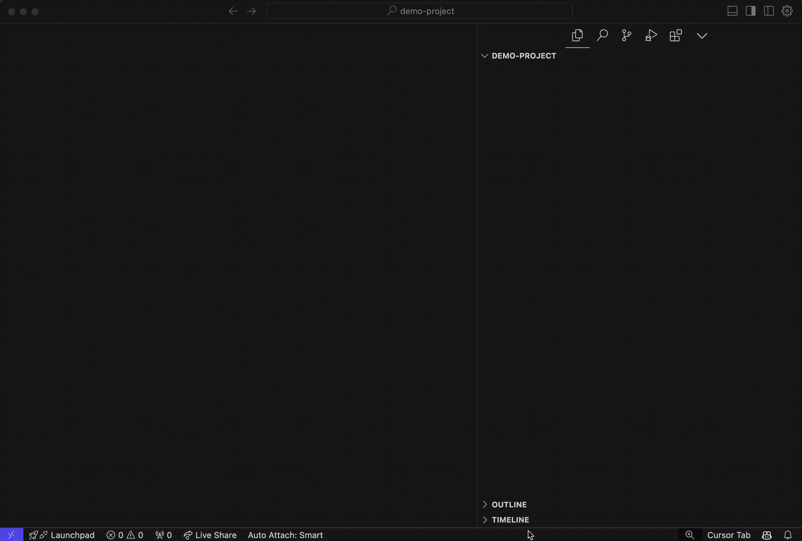

# Cursor Rules Extension Multirepo for Cursor and VSCode

[](https://marketplace.visualstudio.com/items?itemName=juanmaguitar.custom-cursor-rules-multirepo)
[](https://marketplace.visualstudio.com/items?itemName=juanmaguitar.custom-cursor-rules-multirepo)
[](https://opensource.org/licenses/MIT)

An enhanced fork of [Custom Cursor Rules](https://marketplace.visualstudio.com/items?itemName=beilunyang.cursor-rules) by [BeilunYang](https://github.com/beilunyang) with additional features for managing multiple cursor rule repositories.

## New Features in this Fork

- Support for configurable repository sources via `cursorRules.repos` setting
  - Repository order in settings determines the order of rules in the Command Palette

```
"cursorRules.repos": [
    "https://github.com/juanma-ai/my-cursor-rules/tree/main/rules",
    "https://github.com/PatrickJS/awesome-cursorrules/tree/main/rules",
    "https://github.com/tugkanboz/awesome-cursorrules/tree/main/rules"
  ]
```

> [!NOTE]
> Any repo added to `cursorRules.repos` must follow the same structure than https://github.com/PatrickJS/awesome-cursorrules/tree/main/rules to organize the rules (e.g: `rules/appium-mobile-test-automation-framework/.cursorrules`)

- Source indicator in QuickPick UI showing which repository each rule comes from
- User prompt to choose between appending or overwriting .cursorrules file
- Enhanced error handling and typescript definitions

## Usage

- Open the command palette (Cmd+Shift+P or Ctrl+Shift+P) and type "Cursor Rules Multirepo: Add .cursorrules".



- If a `.cursorrule` is detected you can overwrite the existing one or append the selected one to the existing one


## Contributing

- Fork the repository.
- Create a new branch.
- Make your changes and test locally.
- Submit a pull request and wait for approval.

## Credits

This extension is based on the original work by [BeilunYang](https://github.com/beilunyang). Original repository: [vscode-cursor-rules](https://github.com/beilunyang/vscode-cursor-rules)

## License

[MIT License](LICENSE).
